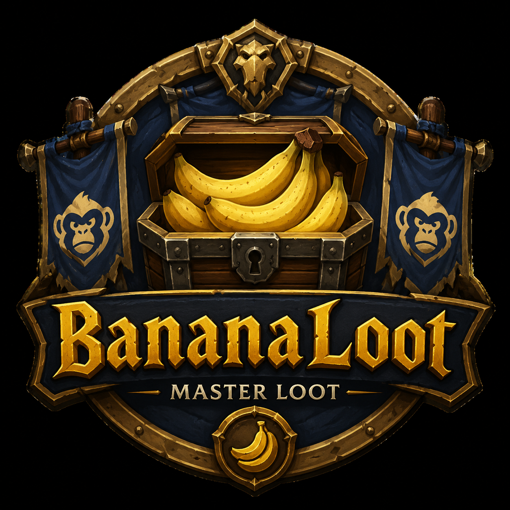
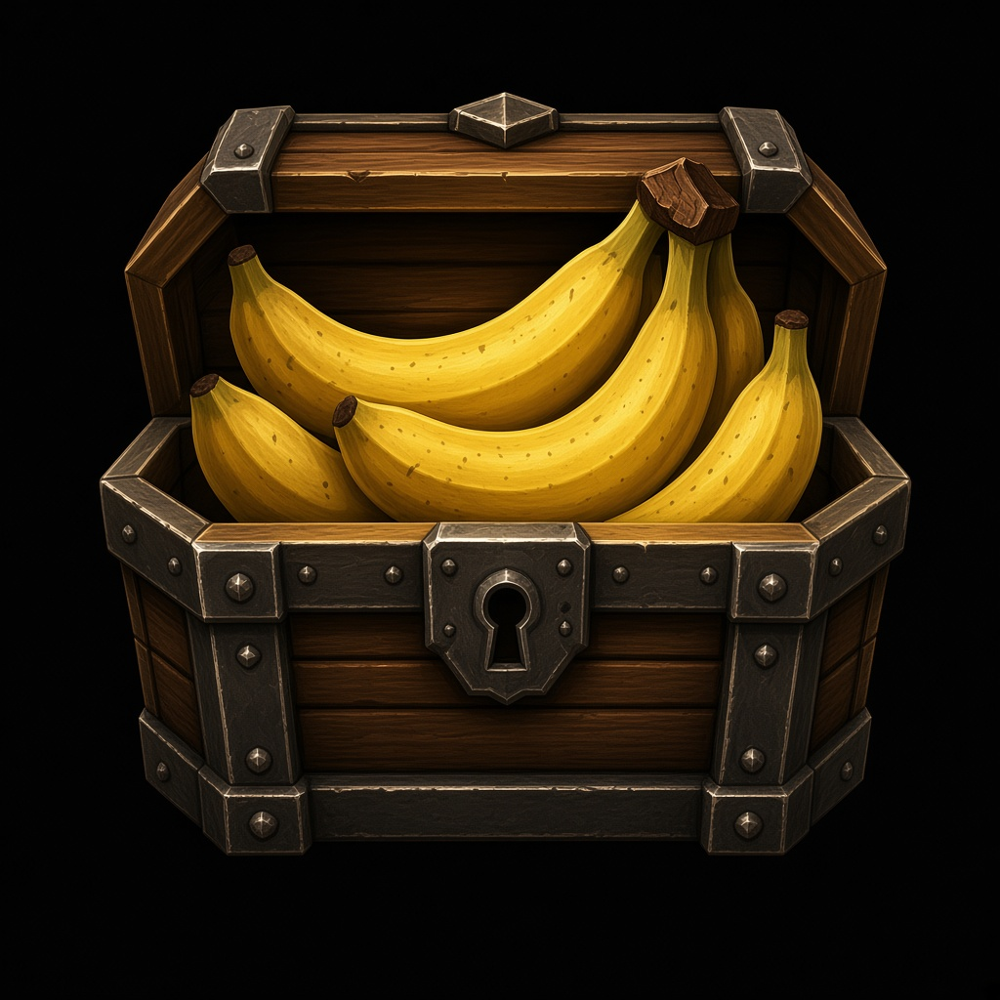

<p align="center">
  
</p>

# 🍌 BananaLoot

**Masterloot addon with chat-based soft-reserves and a local SR+ bonus system**
for World of Warcraft Classic 1.12 (OctoWoW, Turtle WoW, and similar Vanilla servers)

Behavior is inspired by the well-known RollFor workflow – the code itself is
fully original (no code copied from elsewhere).

Part of [BananaForge](https://github.com/BananaForge).

**⬇️ [Download the latest version](https://github.com/BananaForge/BananaLoot/releases/latest)**

---

## What is BananaLoot?

BananaLoot takes the paperwork off the master looter's plate: players reserve
items the normal way via whisper, the addon remembers everything locally,
evaluates rolls automatically, and suggests SR+ bonuses for players who have
soft-reserved an item multiple times without winning it.

No external service, no login, no dependency on working HTTP in the game
client – everything runs entirely locally via SavedVariables. Importing a
list from raidres.top is supported, but purely as a one-time text paste –
BananaLoot never talks to the internet on its own.

---

## Features

### Whisper-based soft reserve
- Players simply whisper `sr [Item]` or `unsr [Item]` to the master looter
- `srlist` shows a player's own reservations including bonus
- `hr` / `hrlist` lists all current Hard Reserve items
- By default exactly 1 SR per player is active – reserving a new item
  automatically drops the old one (with a heads-up sent via whisper).
  Optionally configurable up to 4 simultaneous reservations per player
  (Options → General)
- `/bl sr [Item]` / `/bl unsr [Item]` let the master looter reserve for
  themselves (you can't whisper yourself)
- The SR list can be locked/unlocked for the whole raid with one click –
  while locked, new `sr`/`unsr` whispers are politely declined, but you can
  still edit everything manually in the Manage window
- Spam protection (max. 1 command every 2 seconds per player)
- Unknown commands get a reply instead of being silently ignored
  (can be turned off)

### SR+ bonus system
- Anyone who reserved an item but didn't win it automatically gets a stack
  bonus for the next roll on that same item
- Bonus per stack is freely configurable (default: +10)
- SR+ values persist across raids and relogs
- **SR+ recovery**: if a player accidentally overwrites their reservation
  (or an import replaces it), the most recently displaced reservation per
  player is kept in a recovery list and can be restored with one click
  (`/bl recover`)

### Hard Reserve (HR)
- Permanently reserve items for a specific player, independent of the
  whisper system
- Never rolled automatically – awarded exclusively by hand in the Manage
  window
- Dedicated management view with an overview and a remove button per item,
  reachable via `/bl hr` or the **HR** quick-access button in the SR
  window's title bar

### Bank Reserve (BR)
- A second, independent reserve list for items that should never be rolled
  **or announced** at all – e.g. tradeskill materials for the guild bank,
  BoE items earmarked for sale/crafting
- BR items are detected silently the moment loot opens and are
  automatically awarded to the master looter via the master loot API – no
  roll, no raid/party chat announcement, no entry in the loot window. Only
  a local chat line confirms the award to you
- Managed via `/bl br`, `/bl br [Item]`, `/bl br remove [Item]`, or the
  **BR** quick-access button in the SR window's title bar

### Automatic roll evaluation
- Detects Main Spec (`/roll`), Off-Spec (`/roll 1 99`), and Transmog
  (`/roll 1 98`) rolls automatically via system chat
- Priority: Main Spec > Off-Spec > Transmog
- If an item is soft-reserved, only the reservers may roll Main Spec –
  Off-Spec/Transmog stays open to everyone
- Resolves immediately once all eligible players have rolled (no need to
  wait for the timeout)
- On a tie, only the affected players are automatically asked to re-roll
- Configurable timeout as a fallback (default: 60 seconds)
- Optional chat countdown in the final seconds (10/5/3/2/1), can be toggled off
- **Raid Roll**: award an item to a random raid/party member without
  anyone needing to actually type `/roll` – useful for junk/consolation
  items nobody wants to bother with

### Multi-drop rolls ("top rolls win")
- Optional (Options, default **off**): if multiple copies of the same item
  are sitting in the loot window, BananaLoot starts a single shared roll
  instead of one roll per copy, and the top N rollers (N = number of
  copies) each win a copy
- A tie right at the cutoff only makes the tied players re-roll for the
  remaining copies – players already above the cutoff are locked in
- The loot window lists every winner with their roll/score (greyed out
  once awarded), with one Award click needed per copy
- With the option off (default), or if only a single copy drops, behavior
  is identical to a normal single-winner roll

### Roll-Sync & shared loot history
- Optional (Options, default **off**): broadcasts roll progress (start,
  incoming rolls, ties, winner, cancellation) via addon message to other
  raid/party members who also run BananaLoot with the option enabled
- Recipients get their own small popup window with the item, mode
  (SR/Open/ARF), a live countdown, and a standings list of incoming rolls –
  with MS/OS/TM buttons to roll directly from the popup (same effect as
  typing `/roll` by hand)
- The master looter can optionally see their own popup too (separate
  sub-option, off by default, since they already have the loot window)
- Every award (roll winner, manual award, raid roll) is additionally
  logged to a **shared loot history** (`/bl history`), visible to the
  master looter and everyone with Roll-Sync enabled – session-only, not
  saved to disk. Bank Reserve awards never appear here, by design

### Trade tracking
- Optional (Options, default **off**): automatically detects when an item
  previously awarded via BananaLoot is traded onward to another player,
  and adds the new owner to the corresponding loot log entry ("Traded to"
  column, see `/bl csvlog`)
- Detection happens through your own trade window; hand-offs are shared
  with other trade-tracking-enabled BananaLoot users in the raid/group so
  multi-hop trades stay traceable even if you aren't part of every trade
- Hard limitation of the WoW trade API: a trade between two *other*
  players is only visible if at least one of them also has this option
  enabled

### Loot preview in raid/party chat
- Optional (Options, default **on**): the moment a *new* loot window opens
  – before anyone rolls – BananaLoot posts a one-line-per-item preview so
  everyone knows in advance how each item will be handled:
  `[Item] [SR]: Bareg(+10), Nareg`, `[Item] [Open]`, `[Item] [HR]`
- Bank Reserve items are never part of this preview, since they're meant
  to be awarded completely silently
- Reopening the loot window for the same corpse without looting anything
  new does **not** spam the preview (or the "loot detected" sound) a
  second time

### Loot window automation
- Automatically detects when a loot window is opened as master looter,
  and pops it up on its own
- `/bl auto` works through the entire chest one item at a time: non-SR
  items first (open to everyone), SR items afterward (reservers only) –
  Bank Reserve items are skipped entirely (see above)
- Multiple drops of the same item are counted correctly and handled one by one
- `/bl arf [Item]` suspends SR for a single roll (open to everyone)
- Attempts to award automatically via the master loot API – if that fails,
  the winner is displayed clearly so you can award manually instead

### Two dedicated windows
- **SR window** (`/bl`, minimap left-click): persistent overview of all
  current reservations, independent of whether loot is currently open.
  Holds Export/Import, Save/Load Raid, Options, the SR lock toggle, and
  quick-access buttons for Hard Reserve, Bank Reserve, and the command
  legend. Player names are shown in their class color throughout
- **Loot window** (`/bl loot`): only the items currently visible in the
  real Blizzard loot window, with Roll/ARF/Award actions. Opens
  automatically whenever loot becomes available

### Manage window
- For every item: view all reservers including their SR+ bonus
- Manually adjust SR+ stack (+/-)
- Manually add or remove players
- Directly set a winner and award instantly (with a confirmation prompt),
  or hand it off with a Raid Roll
- Warns if a manually entered name isn't currently in the raid
  (typo protection)
- Context-aware: opened from the SR window it only offers list editing;
  opened from the loot window it additionally offers Winner/Raid Roll,
  and its removal button becomes "Skip drop" (keeps the SR reservation
  intact for a possible re-drop)

### Save Raid / Load Raid
- Save the entire current SR state (reservations, everyone's SR+ values,
  and the SR+ recovery list) locally under a name of your choosing, and
  reload it later – handy for keeping separate raid nights cleanly apart
  or undoing a mistake
- An existing name prompts for confirmation before it gets overwritten
- The Load Raid list shows when each save was last updated, with Load and
  Delete actions per entry
- The name of the currently active saved/loaded raid is shown as a
  subtitle right under the SR window's title
- Hard Reserve and Bank Reserve are intentionally **not** part of a
  snapshot – they're meant to persist across raids, not be tied to one
- Fully independent of Export/Import below – both remain available side
  by side

### Export / import for a stand-in loot master
- Export the complete SR list (including SR+ values and Hard Reserves) as
  text, timestamped so an old export can be flagged as stale
- The stand-in simply pastes the text into their own BananaLoot and is
  immediately up to date
- **raidres.top import**: paste a raidres.top export directly and
  BananaLoot decodes and applies it (soft reserves, plus-ones, and hard
  reserves) – no manual re-typing needed

### Static item database
- Ships with a built-in item database (~3600 entries, sourced from
  AtlasLoot – see [Credits](#-credits)) used as a fallback whenever the
  server's `GetItemInfo()` doesn't know an item yet (very common for
  items nobody has looted, inspected, or linked this session)
- Lets raidres.top imports and Hard/Bank Reserve entries show the real,
  correctly colored item name immediately, instead of just "Item #12345"
  until the item actually drops

### LFM poster for the world channel
- `/bl lfm` (or the **LFM** button in the SR window) opens a small window
  that posts a text of your choice to the world channel at a fixed
  interval – e.g. for PUG raid ads or to replace a player who left
- Up to 255 characters with a live counter, interval in minutes
  (minimum 1, to stay clear of the server's chat spam protection)
- One Start/Stop button; text and interval are saved, but posting
  **never** restarts on its own after a relog or `/reload`
- The world channel's number is looked up by name before every post
  instead of being hard-wired to `/4`

### CSV export for Google Sheets
- Export the SR list and the full loot log as tab-separated text
- Just paste into an empty cell in Google Sheets – done

### Options
- Split into five tabs; the window adjusts its height to the active tab
- General: SR+ bonus per stack, roll timeout, max. simultaneous SR per
  player, unknown-command replies
- Automation: auto Master Loot on boss target, multi-drop ("top rolls
  win"), loot preview, chat countdown
- Network: Roll-Sync (plus the master looter's own popup), trade tracking
- Display & Sound: language (German/English, one click), UI scale and a
  separate loot window scale (50–150%, handy on small screens), and
  individual sound toggles for loot detected / roll started / winner
  determined / item awarded / button clicks (plus one master switch)
- Management: new raid, full SR+ wipe, CSV exports, log clearing, SR+
  recovery

### Other
- Loot log records every award (date, item, player, category, plus who it
  was traded to, if trade tracking is enabled)
- Draggable minimap button with a custom icon and a tooltip summary of
  current SR reservations
- Dedicated options window with banner
- Small ML/GL button (next to the SR lock toggle) switches WoW's actual
  loot method between Master Loot and Group Loot with one click (only
  works while you're the party/raid leader)
- Optional automatic switch to Master Loot when targeting a known raid
  boss (Options → Automation)

---

## Installation

1. Download `BananaLoot-<version>.zip` from the
   [latest release](https://github.com/BananaForge/BananaLoot/releases/latest)
2. Extract it into `World of Warcraft/Interface/AddOns/` – you should end up
   with `Interface/AddOns/BananaLoot/BananaLoot.toc`
3. Restart the client or `/reload`
4. Keep it enabled under "AddOns" on the character selection screen
5. The addon can be switched from German to English with a single click
   under Options → Display & Sound

> **Don't use GitHub's green "Code → Download ZIP" button.** It produces a
> folder called `BananaLoot-main`, and the client then finds neither the
> addon nor its icons. If you did, rename the folder to `BananaLoot`.

The release ZIP also contains `ANLEITUNG.txt`, the full German manual.

---

## Key commands

| Command | Effect |
|---|---|
| `/bl` | Open/close the SR window |
| `/bl loot` | Open/close the Loot window (also opens automatically when loot is detected) |
| `/bl auto` | Automatically work through the current loot chest |
| `/bl award` | Award the most recently evaluated item to the winner |
| `/bl arf [Item]` | Open roll for everyone, SR suspended for this roll |
| `/bl sr [Item]` / `/bl unsr [Item]` | Reserve / unreserve an item for yourself as master looter |
| `/bl stop` | Cancel auto mode / the active roll |
| `/bl reset` | Clear all current reservations (SR+ values are kept) |
| `/bl wipeplus` | Completely reset all SR+ values |
| `/bl export` / `/bl import` | Share the SR list with a stand-in (also accepts raidres.top exports) |
| `/bl csv` / `/bl csvlog` | Export the SR list / loot log as CSV for Google Sheets |
| `/bl hr [Item]` / `/bl hr remove [Item]` / `/bl hr` | Manage the Hard Reserve list |
| `/bl br [Item]` / `/bl br remove [Item]` / `/bl br` | Manage the Bank Reserve list |
| `/bl recover` | Show the SR+ recovery list |
| `/bl history` | Show the shared loot history for this session (Roll-Sync) |
| `/bl clearlog` | Clear the loot log (e.g. at the start of a season) |
| `/bl lfm` | Open the LFM window (timed posts in the world channel) |
| `/bl options` | Open settings |

Full command overview is also available in-game via the **?** button in
the SR window's title bar. Save Raid / Load Raid are button-only (SR
window) and don't have a slash command.

---

## Honestly: limitations of this addon

No loot tool is perfect – here are the deliberate trade-offs:

- **Automatic awarding is best-effort.** Assignment via the master loot API
  can fail depending on the server implementation. In that case the addon
  clearly displays the winner so the final award can be done manually in
  the Blizzard loot window.
- **No softres.it import.** raidres.top is supported (see Features); other
  formats would need their own decoder.
- **No automatic class or spec prioritization.** Everything runs on rolls,
  not on a rules engine.
- **Loot source detection is content-based, not ID-based.** Vanilla gives
  no unique loot-source identifier, so "was this the same corpse reopened"
  is inferred from the exact item set still present – extremely unlikely,
  but two unrelated kills with a coincidentally identical item set could
  in theory be treated as the same loot window.
- **Roll-Sync and trade tracking only work between BananaLoot users.**
  They're purely client-side addon-message features with no server
  component; players without the option enabled are invisible to them.
- The static item database can't know about items added after it was last
  generated – those simply show as "Item #ID" until actually looted once,
  exactly like before the database existed.
- Tested primarily on OctoWoW/Turtle WoW – other 1.12 servers may differ in
  details (e.g. master loot API behavior).

---

## Technical details

- Pure Lua, no XML – the entire UI is built at runtime
- Compatible with Lua 5.0 (no `#` operator, no `string.gmatch`)
- Data is stored locally in
  `World of Warcraft/WTF/Account/<ACCOUNT>/SavedVariables/BananaLoot.lua`
  and survives relogs and patches

### Repository layout

```
BananaLoot.toc            Addon manifest (version lives here and in BananaLoot.lua)
BananaLootItemDB.lua      Static item database (AtlasLoot-derived data)
BananaLoot.lua            Core: SavedVariables, locales, whispers, rolls, awarding,
                          raidres.top import, Roll-Sync, trade tracking, slash commands
BananaLootUI.lua          SR window, loot window, Roll-Sync popup
BananaLootExtra.lua       Options, Manage window, HR/BR lists, export/import, CSV,
                          SR+ recovery, LFM, Save/Load Raid, minimap button
Icons/                    TGA textures loaded in-game
docs/ANLEITUNG.txt        Full German user manual (shipped in the release ZIP)
docs/ENTWICKLUNG.md       Developer notes (German)
tools/                    Checks run by CI: syntax, Lua 5.0 compatibility, TOC, version
assets/                   Images for this README only (not shipped)
```

### Development

- `bash tools/run_tests.sh` runs all checks locally (needs `lua5.1`).
  They also run on every push via GitHub Actions.
- **Releasing:** bump `## Version:` in `BananaLoot.toc` *and*
  `BananaLoot.VERSION` in `BananaLoot.lua`, add a `CHANGELOG.md` entry,
  push to `main`. The release workflow tags the version and attaches a
  correctly named `BananaLoot-<version>.zip`.

---

## Changelog

See [CHANGELOG.md](CHANGELOG.md).

---

## Author

**Bareg**

🍌 Made for my guild, the Bananenrepublik – part of [BananaForge](https://github.com/BananaForge) 🍌

---

## 🙏 Credits

BananaLoot's code is fully original, but it stands on the shoulders of a
few great community projects and resources:

- **[RollFor](https://github.com/WowRollFor/RollFor)** – the soft-reserve
  workflow (whisper `sr`/`unsr`, automatic roll evaluation, SR+-style
  bonus stacking) that BananaLoot's behavior is modeled after.
- **[AtlasLoot – OctoWoW fork](https://octowow.st/git/shaga/AtlasLoot)** –
  primary source for the bundled static item database, including custom
  server content.
- **[AtlasLootClassic](https://github.com/krullgor/AtlasLootClassic)** –
  secondary, generic Vanilla item data used to fill gaps the OctoWoW fork
  doesn't cover.
- **[raidres.top](https://raidres.top/)** – the external soft-reserve
  website whose export format BananaLoot can import directly.

If your project or work should be credited here and isn't, please open an
issue – it wasn't intentional.

---

## ☕ Support the Project

If you enjoy BananaLoot and want to support its development:

[☕ Buy me a Coffee](https://www.buymeacoffee.com/bareg)

or you can send me an in-gane Mail with a donate to [N'Zoth] Bareg. Thank you for your Support! 

---
## License

Use at your own risk. Not a substitute for common sense while master looting. 🍌

BananaLoot's original source code and original artwork are licensed under the MIT License.
The bundled item database contains data derived from AtlasLoot / AtlasLootClassic. See THIRD_PARTY_NOTICES.md for attribution and source information.

<p align="center">
  
</p>
